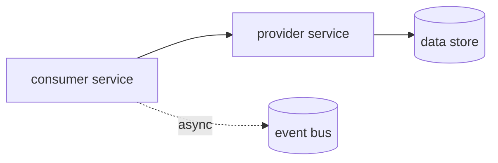

# Internal dependencies

The cross-service view. Individual service docs answer "what does this one do"; this file
answers "what does this one take down with it".

This is the file the `triage-structure` skill jumps to when the alerting system is not the
broken system - see
[`../../triage-structure/guides/nested.md`](../../triage-structure/guides/nested.md).

> Last reviewed: <!-- FILL: YYYY-MM-DD -->

## How to read this

**Criticality is a property of the edge, not of either service.** It answers: can the consumer
do its job without the provider? `critical` = no. `degraded` = partially, and the table says
which part. `optional` = yes, and nobody notices until later.

**"Failure impact" is written from the consumer's point of view,** in observable terms. "Returns
errors" is not an impact; "checkout fails while browsing continues" is - it tells you who is
about to complain and what to say to them.

**Async edges hide their own failures.** A synchronous dependency failing produces errors
someone sees immediately. An asynchronous one produces *silence* - work simply stops happening,
and it is often reported by a customer rather than detected by a monitor. Mark async edges
clearly; they are the ones that cost you detection time.

## Dependency table

One row per edge. When you add an edge, add it to both service docs as well - this table is a
view over them, and a row here with no corresponding entry there is a sign one of the three is
stale.

| Consumer | Depends on | Via | Criticality | Failure impact (what the consumer sees) |
|---|---|---|---|---|
| <!-- FILL --> | <!-- FILL --> | <!-- FILL: sync / async / shared store --> | <!-- FILL --> | <!-- FILL --> |
|  |  |  |  |  |

## Graph

<!-- FILL: replace the placeholder nodes with your services. Keep the direction consistent -
     an arrow points from the consumer to what it depends on, so following arrows forward
     answers "why am I broken" and following them backwards answers "who will notice".
     Mark async edges with a dotted line; they are the ones with delayed detection. -->

## Shared infrastructure

Dependencies that do not appear as service-to-service edges but take down several services at
once. These are the ones that turn a single incident into an all-hands one, and they are easy
to leave off a graph because nobody owns them as a "service".

| Component | Used by | Failure impact | Notes |
|---|---|---|---|
| <!-- FILL: e.g. the auth provider, the event bus, the shared cache, DNS, the CI/deploy pipeline --> | <!-- FILL --> | <!-- FILL --> | <!-- FILL --> |

## Single points of failure

<!-- FILL: the components with no redundancy and no graceful degradation, and what the plan is
     for each. Listing one honestly is more useful than a page of mitigations that do not
     exist. If the plan is "accept the risk", write that - an accepted risk is a decision; an
     unlisted one is a surprise. -->

## Known cycles

<!-- FILL: any pair or group of services that depend on each other. Cycles matter here because
     they break the assumption that you can restore services in dependency order - a cycle has
     no valid order, so recovery needs a documented sequence. If you have none, write "none
     known" and the next reader will not have to work it out. -->

## Deliberate degradation

<!-- FILL: where a dependency failure is handled gracefully - a cache that serves stale data, a
     queue that buffers, a fallback path. Record the limits: how stale, how long, how much.
     "It buffers" without a number is not something anyone can make a decision from at 3am. -->

| Consumer | On failure of | Degrades to | For how long | Then |
|---|---|---|---|---|
| <!-- FILL --> | <!-- FILL --> | <!-- FILL --> | <!-- FILL --> | <!-- FILL --> |
